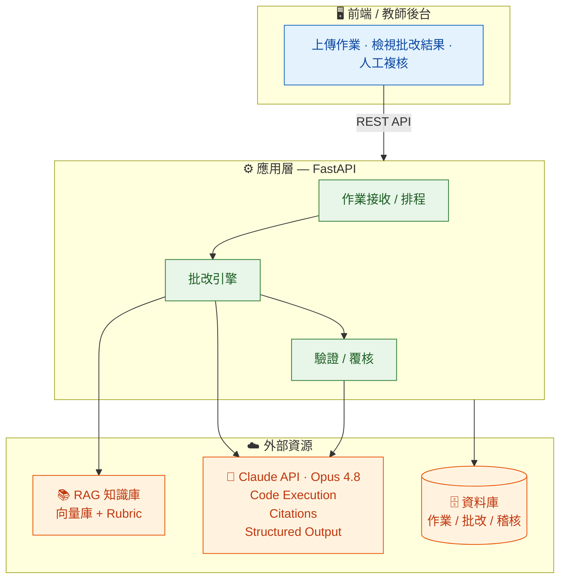
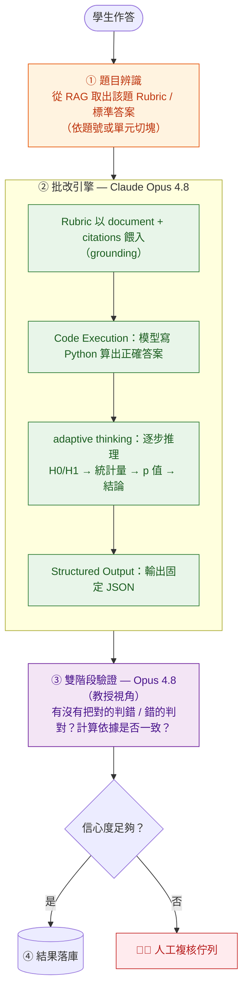
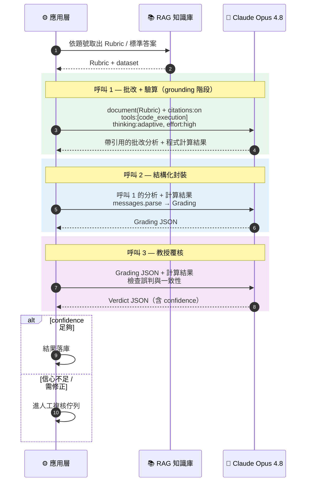
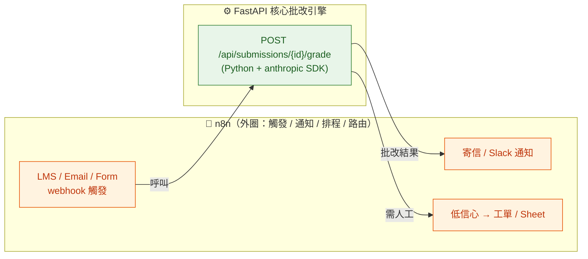

# Smart-Stat 統計學作業批改平台 — 架構規格書

| 項目 | 內容 |
|------|------|
| 文件版本 | v0.1（草案） |
| 撰寫日期 | 2026-06-26 |
| 核心目標 | 用 LLM 自動批改統計學作業，並以「三管齊下」最大程度消除 AI 幻覺 |
| 主要模型 | Claude Opus 4.8（`claude-opus-4-8`）、Claude Sonnet 4.6（`claude-sonnet-4-6`） |
| 狀態 | 規格定義中，尚未實作 |

---

## 1. 問題定義與設計原則

### 1.1 為什麼統計批改特別怕幻覺
統計學作業包含大量**數學計算**（開根號、卡方分配、查 t 表）、**統計檢定判讀**（p-value 與 α 比較）、以及**專有名詞**。LLM 本質是文字接龍，在以下三類最容易「一本正經地胡說八道」：

| 幻覺類型 | 範例 | 後果 |
|----------|------|------|
| 計算幻覺 | 標準差、自由度、檢定統計量算錯 | 把對的扣成錯、錯的給滿分 |
| 標準答案幻覺 | 自行腦補一套「標準解法」 | 與課程 Rubric 不符 |
| 判讀幻覺 | p=0.03、α=0.05 卻說「不顯著」 | 結論方向相反 |

### 1.2 三大防幻覺原則（對應到技術機制）

| 原則 | 對應機制 | 章節 |
|------|----------|------|
| **不讓模型憑空批改** | RAG + Citations，把標準答案釘在來源上 | §3 |
| **不讓模型自己算數學** | Server-side Code Execution（scipy/statsmodels） | §4.2 |
| **不讓模型自由發揮輸出** | Structured Outputs（強制 JSON schema） | §4.3 |
| **不讓單一模型說了算** | 雙階段驗證（批改 → 教授覆核） | §5 |

---

## 2. 系統總覽

### 2.1 架構分層



### 2.2 單題批改資料流（核心流程）



---

## 3. RAG 知識庫層（標準答案 / 給分標準）

### 3.1 分塊策略（Chunking）
- **以「題號」或「統計單元」為切割邊界**，確保檢索「迴歸分析作業一」時不會撈到「假設檢定」的答案。
- 每個 chunk 的 metadata 至少包含：`unit`（單元）、`question_id`（題號）、`rubric_version`、`max_score`。

### 3.2 知識庫內容結構

| 欄位 | 說明 |
|------|------|
| `question_id` | 題目唯一 ID |
| `question_text` | 題目原文 |
| `standard_answer` | 標準解答（含計算步驟） |
| `rubric` | 給分標準（各步驟配分） |
| `unit` | 所屬統計單元（如：假設檢定、迴歸分析） |
| `dataset` | 題目附帶的數據（供 Code Execution 重算） |

### 3.3 Grounding 機制（防「標準答案幻覺」的關鍵）
- 將 `standard_answer` 與 `rubric` 以 **`document` content block** 傳入，並設 `citations: {enabled: true}`。
- 模型批改時須**引用 Rubric 的確切文字片段**，回應會切成多個帶 `citations` 的 text block。
- System Prompt 強制規定：
  > 「你必須嚴格對照提供的【標準答案】與【給分標準】批改。學生的計算過程或答案與標準答案不符時，請引用標準答案中的對應文字並指出具體錯誤，**絕對不可自行發揮或假設另一套解法**。」

> ⚠️ 注意：Citations 與 Structured Outputs（`output_config.format`）**不可同時使用**（API 會回 400）。因此 grounding（Citations）與最終 JSON 輸出（Structured Output）分屬不同階段，見 §6。

---

## 4. 批改引擎

### 4.1 模型選擇

| 用途 | 模型 | 理由 |
|------|------|------|
| 主批改 / 覆核 | `claude-opus-4-8` | 最強推理，抓計算與判讀錯誤 |
| 大量批改（成本敏感） | `claude-sonnet-4-6` | 速度/成本平衡 |

- 推理深度：`output_config={"effort": "high"}`（統計推理建議 high）。
- 思維鏈：`thinking={"type": "adaptive"}`（4.x 用 adaptive thinking，**不再手動寫 step-by-step**）。

### 4.2 Code Execution —— 消除「計算幻覺」（核心）
- 宣告 server-side 工具，沙箱預裝 `scipy`、`statsmodels`、`numpy`、`pandas`、`sympy`：
  ```python
  tools=[{"type": "code_execution_20260120", "name": "code_execution"}]
  ```
- **執行邏輯**：模型從題目/學生答案抽取數據 → 自動寫 Python 算出**絕對正確**的 p 值、檢定統計量、自由度 → 再拿來比對學生答案。
- **鐵則**：絕不讓 LLM 用文字接龍硬算來扣分；所有數值判定必須有 Code Execution 的程式輸出為依據。
- 回應中對應的結果區塊型別為 `bash_code_execution_tool_result`（`.content.stdout`）。

### 4.3 Structured Outputs —— 消除「輸出幻覺」
- 用 `client.messages.parse()` + Pydantic 強制 schema（見 §7 資料模型）。
- 模型聚焦在指定維度，大幅減少廢話與自由發揮。

### 4.4 提示詞工程（Prompt Engineering）
- **Few-Shot**：在 system prompt 放 2–3 組「正確批改」與「錯誤批改」範例，特別針對計算錯誤（標準差算錯、自由度抓錯）。
- **評分維度**（交給 adaptive thinking 內部推理，輸出到 structured fields）：
  1. H0 / H1 假設是否正確
  2. 檢定統計量計算是否正確（對照 Code Execution）
  3. 臨界值 / p-value 是否正確
  4. 最終結論方向是否正確
  5. 綜合評語

---

## 5. 雙階段驗證機制（Self-Correction）

| 階段 | 角色 | 輸入 | 輸出 |
|------|------|------|------|
| 第一階段：批改 | LLM A（Opus 4.8） | 學生作答 + Rubric + Code Execution 結果 | 批改報告 JSON |
| 第二階段：覆核 | LLM B（Opus 4.8，教授視角） | 第一階段 JSON + Code Execution 結果 | 覆核結論 + 修正建議 |

- 覆核指令：
  > 「你是統計學教授。請檢查這份批改報告是否符合統計學理？有沒有把**對的算成錯的**，或把**錯的算成對的**？是否與程式計算的正確答案一致？」
- 覆核回傳 `verdict`（通過 / 需修正）與 `confidence`；低信心或「需修正」者進**人工複核佇列**。

---

## 6. 端到端流程（含 Citations / Structured Output 分離）

由於 Citations 與 Structured Outputs 不可同時開啟，採**三次呼叫**設計：



> 設計取捨：若不需要逐句引用，可把呼叫 1、2 合併（直接 Structured Output），以降低成本與延遲。Citations 是「最高防幻覺」與「成本」之間的選項，可依題型開關。

---

## 7. 資料模型（Schema）

### 7.1 批改結果 Grading
```python
class StepCheck(BaseModel):
    name: str            # 維度名稱，如 "檢定統計量"
    correct: bool
    comment: str         # 具體說明
    cited_rubric: str | None = None   # 引用的標準答案片段

class Grading(BaseModel):
    question_id: str
    score: int
    max_score: int
    h0_h1_correct: bool
    test_statistic_correct: bool
    pvalue_judgment_correct: bool
    conclusion_correct: bool
    steps: list[StepCheck]
    error_type: str            # 主要錯誤類型
    correct_step: str          # 正確解法摘要
    overall_comment: str       # 綜合評語
    computed_values: dict      # Code Execution 算出的正確數值
```

### 7.2 覆核結果 Verdict
```python
class Verdict(BaseModel):
    grading_is_sound: bool          # 批改是否合乎統計學理
    found_false_negative: bool      # 是否把對的判錯
    found_false_positive: bool      # 是否把錯的判對
    corrections: list[str]
    final_score: int                # 覆核後分數
    confidence: float               # 0~1
    needs_human_review: bool
```

---

## 8. API 設計（草案）

| Method | Path | 說明 |
|--------|------|------|
| POST | `/api/submissions` | 上傳學生作答，回傳 `submission_id` |
| POST | `/api/submissions/{id}/grade` | 觸發批改（非同步） |
| GET | `/api/submissions/{id}/result` | 取得批改 + 覆核結果 |
| GET | `/api/review-queue` | 人工複核佇列（低信心案件） |
| POST | `/api/review-queue/{id}/resolve` | 教師人工裁定 |
| CRUD | `/api/rubrics` | 管理標準答案 / 給分標準知識庫 |

---

## 9. 技術棧（建議預設，可調整）

| 層 | 選型 | 備註 |
|----|------|------|
| 後端 | Python 3.11 + FastAPI | 最貼合 Claude Code Execution + 統計生態 |
| LLM SDK | `anthropic`（官方 Python SDK） | 用 `messages.parse()`、`code_execution` |
| 向量庫 | （待定）pgvector / Chroma / Qdrant | RAG Rubric 檢索 |
| 資料庫 | PostgreSQL | 作業、批改、稽核紀錄 |
| 非同步 | Celery / RQ 或 FastAPI BackgroundTasks | 批改為長任務，建議排程 |
| 前端 | （待定）教師後台 | 檢視結果 / 人工複核 |

> n8n 的取捨見 §9.1 備案一；容器化評估見 §9.2。

### 9.1 備案一：n8n 混合式架構

**核心結論：核心批改引擎不放 n8n，n8n 只當外圈膠水層。**

#### 為什麼核心引擎不適合 n8n
批改流程是「程式密集 + 用到 Claude 最新功能」，正好是 n8n 最吃力處：

| 需求 | 在 n8n 裡的真實情況 |
|------|---------------------|
| Code Execution（`code_execution_20260120`） | 內建 AI 節點不支援此 server-side 工具，須改用 HTTP Request 手刻 JSON |
| Citations grounding | 同上，須手刻 `document` block 並解析帶引用回應 |
| Structured Outputs / `messages.parse()` | 無 Pydantic 驗證，schema 校驗須自補 |
| 三次呼叫 + 信心度分支 + 重試 | 視覺節點拉條件/loop/錯誤處理，比寫程式更難維護 |
| 版本控管 / 單元測試 | workflow 的 git diff 與測試能力遠不如程式碼 |

> 一旦被迫用 HTTP Request 節點手刻所有 Claude 請求，n8n 的「低程式碼」優勢即消失——等於用更難 debug 的方式寫程式。

#### n8n 真正有意義的地方：外圈編排
- **觸發來源**：LMS / Google Form / Email 交卷 → webhook 觸發批改
- **通知**：批改完成 → 寄信、Slack/Teams
- **排程**：每晚批次批改、定時清理佇列
- **人工複核路由**：低信心案件自動建工單 / Google Sheet
- 讓**非工程師**維護這些串接，不動核心程式

#### 混合式架構



#### 何時導入 n8n

| 情況 | 建議 |
|------|------|
| 團隊有 Python 能力、先做 MVP 驗證防幻覺 | **純 FastAPI，先不導入 n8n** |
| 之後要接 LMS/Email/通知，且想讓非工程師調整串接 | **再加 n8n 當外圈**，核心仍在 FastAPI |
| 純粹想快速 demo、團隊不寫 code | n8n 可，但會卡在上表限制 |

> 決議：**n8n 非現階段必需**。先用 FastAPI 把核心批改與防幻覺做出來、驗證有效，需接外部系統時再評估。

### 9.2 Docker / 容器化評估

> ⚠️ **重要澄清：不需要 Docker 來沙箱執行 Python 計算。** Claude 的 Code Execution 是 server-side，Python 在 Anthropic 雲端沙箱執行，不在自有機器上。Docker 的價值在**多服務編排**，與「隔離程式執行」無關。

| 服務 | 不用 Docker | 用 docker-compose |
|------|------------|-------------------|
| FastAPI | venv 自行安裝 | 一行 `docker compose up` 全起 |
| PostgreSQL | 本機裝、版本各異 | 容器固定版本 |
| 向量庫（Qdrant/Chroma） | 各自安裝麻煩 | 容器一拉就好 |
| 環境一致性 | 「我機器能跑」問題 | dev/prod 一致 |
| 未來加 n8n | — | n8n 官方即以 Docker 部署 |

**導入時機**

| 階段 | 是否導入 Docker |
|------|----------------|
| 最初單檔原型（僅測防幻覺效果） | **可省略**，venv + 本機/雲端 Postgres 即可 |
| 要接向量庫 + DB + 多人協作 | **建議用 docker-compose**（成本低、省環境設定痛點） |
| 上線部署 | **需要**，容器化為標配 |

> 決議：**非最初原型的必需品，但建議一開始即採 docker-compose**，因為遲早要 API + PostgreSQL + 向量庫三件並行。

---

## 10. 防幻覺機制總覽（對照表）

| 幻覺風險 | 防護機制 | 落點 |
|----------|----------|------|
| 計算錯誤 | Code Execution（真實執行 scipy） | §4.2 |
| 腦補標準答案 | RAG + Citations grounding | §3.3 |
| 判讀方向錯誤 | adaptive thinking 分維度推理 + 覆核 | §4.4 / §5 |
| 輸出胡言亂語 | Structured Outputs 強制 schema | §4.3 |
| 單模型誤判 | 雙階段驗證 + 信心度門檻 + 人工複核 | §5 |

---

## 11. 風險與限制

| 風險 | 說明 | 緩解 |
|------|------|------|
| 成本/延遲 | 雙階段 + Citations 為多次呼叫 | 依題型開關 Citations；大量題用 Sonnet 4.6 |
| Code Execution 抽取錯誤 | 模型可能抽錯數據再去算 | 覆核階段比對；數據盡量結構化存於 Rubric |
| 主觀題 | 證明題/文字論述難以程式驗證 | 標記為「需人工」；信心度門檻調嚴 |
| Rubric 維護 | 知識庫品質決定批改品質 | 版本控管 `rubric_version`；定期校對 |
| 安全性 | API 金鑰、學生 PII | 金鑰走環境變數；資料庫加密；遵循個資法 |

---

## 12. 後續步驟（建議）

1. 確認技術棧（FastAPI vs n8n、向量庫選型）。
2. 以**單題假設檢定**做可跑原型：批改 → Code Execution 驗算 → Structured Output → 雙階段覆核。
3. 建立 3–5 題標準 Rubric 作為 RAG 種子資料。
4. 用 10–20 份真實/模擬答卷做幻覺壓力測試（含故意算錯的陷阱題）。
5. 校準信心度門檻與人工複核比例。
